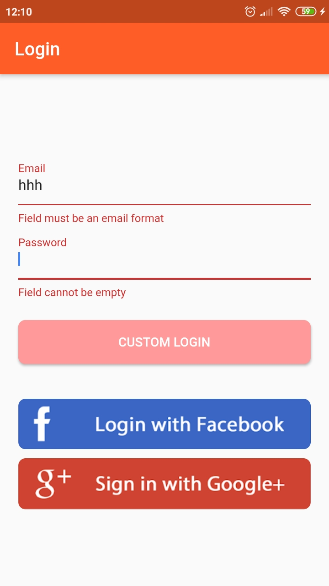
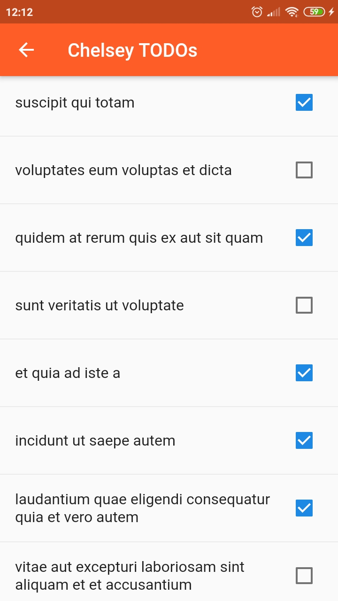

# JsonPlaceholder App

This is an app that consumes the JsonPlaceholder API with Flutter

## App Features

The app has the following features:
- Strategy pattern on the login
- Providers to manage the HTTP and SQLite data
- HTTP requests centralized in a Helper and the possibility to have some environments (local, beta and production)
- Singleton pattern when necessary
- SOLID principles
- Bloc pattern to communicate data received from providers reactively
- StreamBuilders
- FutureBuilders
- Custom widgets
- Shared preferences to manage if the last logged user is actually logged
- Routes to manage navigation between activities
- User search that allowes us to filter by many words
- RefreshIndicator

## Screenshots

           
